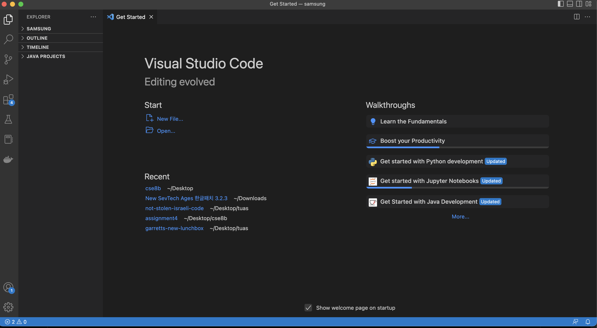
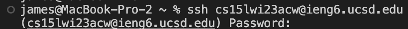
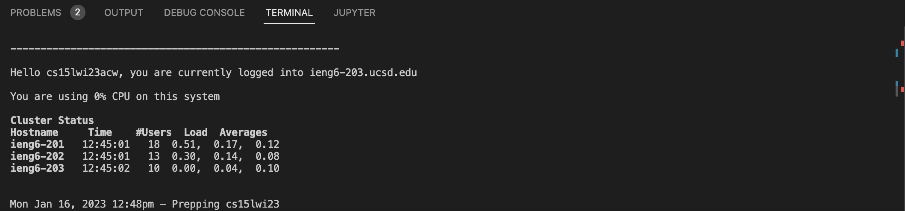
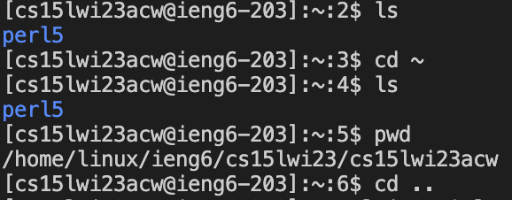
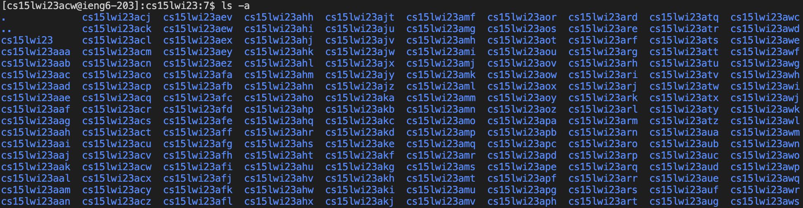
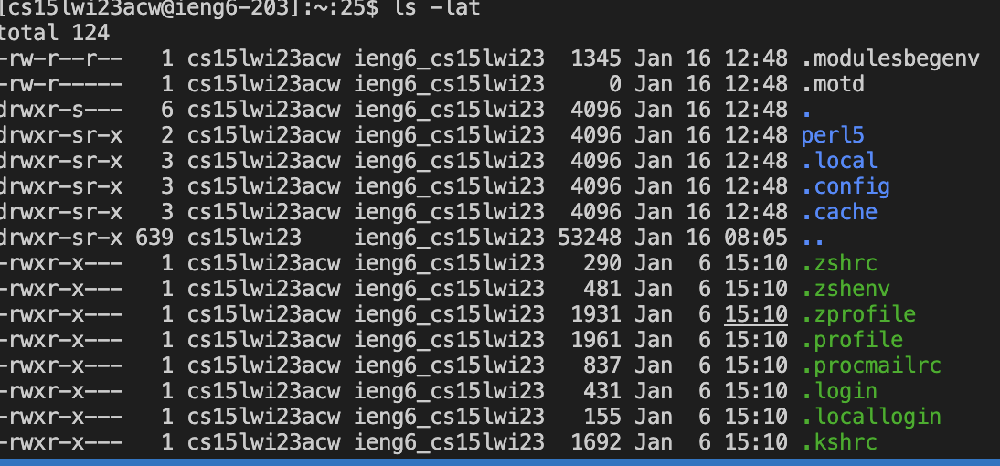
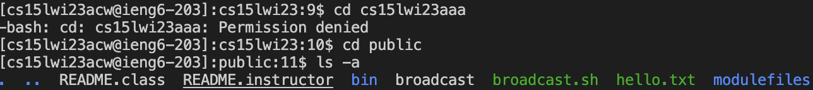
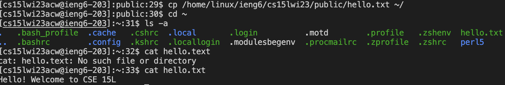

# Lab Report 1
---

**Installing VS Code**

* Go to the Visual Studio Code Website  [link](https://code.visualstudio.com/) and follow instructions to download based on operating system
* After downloading Visual Studio Code should look like this when opened. *(may have different colors)*

* the screenshot above is what the main interface looks like after opening other directories so do not be afraid if different.

**Remotely Connecting**

* Open your terminal in VS Code by either (Ctrl or Command + \` or use the Ternimal > New Terminal menu option.)
* Then type `ssh cs15lwi23zz@ieng6.ucsd.edu` and replacing zz with the letters in your course specific account.
*You can look for your own CSE15L account with the link [Link](https://sdacs.ucsd.edu/~icc/index.php)*
* The terminal will ask for your password like below 

*prompt after entering your password*

**Running Some Commands**
* Aftering getting access to the Remote Server, it is time to try some commands
Some commands include:
* `cd ~`
* `cd`
* `ls -lat`
* `ls <directory>` where `<directory>` is
* `cp /home/linux/ieng6/cs15lwi23/public/hello.txt ~/`
* `cat <filename>` where `<file>` is
---
* Here are some examples of using the above commands in the Remote Server

*Running `ls -a` and `ls -lat`*. 
 
. 
*Trying to access other people's directories will lead to Permission denied which is normal*

*Trying the `cp` and `cat` commands*

* To log out of the remote server in the terminal use:
* Ctrl-D or command `exit`
