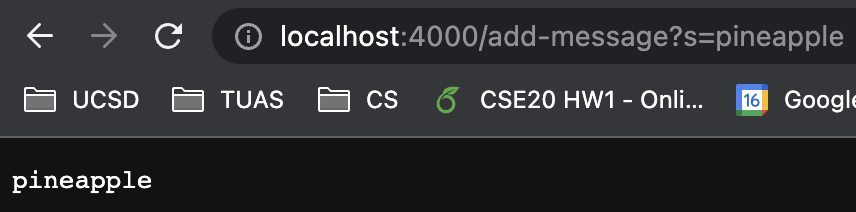
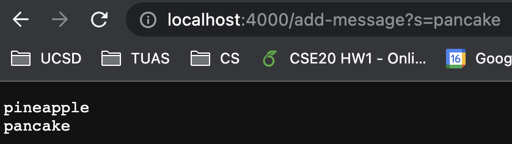
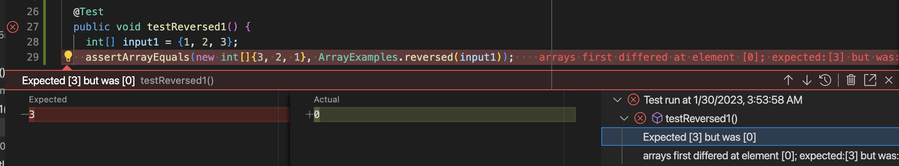
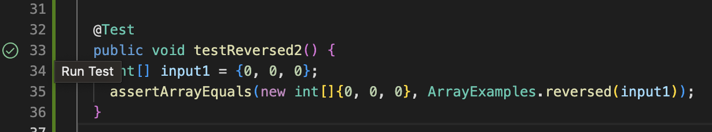

# Lab Report 2
---

**Part 1: Making StringServer**  
The code for StringServer is as below  
```
import java.io.IOException;
import java.net.URI;

class Handler implements URLHandler {
    String result = "";

    public String handleRequest(URI url) {
        if (url.getPath().equals("/")) {
            return result;
        }
        else {
            System.out.println("Path: " + url.getPath());
            if (url.getPath().contains("/add-message")) {
                String[] parameters = url.getQuery().split("=");
                if (parameters[0].equals("s")) {
                    result += parameters[1] + "\n";
                    return result;
                }
            }
            return "404 Not Found!";
        }
    }
}

class StringServer {
    public static void main(String[] args) throws IOException {
        if(args.length == 0){
            System.out.println("Missing port number! Try any number between 1024 to 49151");
            return;
        }

        int port = Integer.parseInt(args[0]);

        Server.start(port, new Handler());
    }
}
```  
  
* When typing in the following url: *localhost:4000/add-message?s=pineapple*, the method handleRequest from class Handler is called.
* Relevant arguments for the method above is the *URI url*. The field *String result* stores the input + "\n"(newline) for each input that is taken in the query part(after ?) of the url. The value for the *String result* is changed from ""(empty String) to "pineapple\n" after taking in the above url as a request.   
  
* When typing in the following url: *localhost:4000/add-message?s=pancake*, the method handleRequest from class Handler is called.
* Relevant arguments for the method above is the *URI url*. The value for the *String result* is changed from "pineapple\n"(empty String) to "pineapple\npancake\n" after taking in the above url as a request.   

---

**Part 2: Bug Fixing**

The bug for this case is the method *reversed* in ArrayExamples.java. 
* An example of a failure inducing input is
```
  @Test
  public void testReversed1() {
    int[] input1 = {1, 2, 3};
    assertArrayEquals(new int[]{ 3, 2, 1}, ArrayExamples.reversed(input1));
  }
```
* An example of an input that doesn't induce failure is
```
  @Test
  public void testReversed2() {
    int[] input1 = {0, 0, 0};
    assertArrayEquals(new int[]{ 0, 0, 0}, ArrayExamples.reversed(input1));
  }
```
* The symptom for inputting the failure inducing input can be seen as resulting in an int[] array containing only zeros instead of reversing the array as intended.
  
*failure*  
   
*success*  

There is bug in the code is where instead of `arr[i] = newArray[arr.length - i - 1];`
```
  static int[] reversed(int[] arr) {
    int[] newArray = new int[arr.length];
    for(int i = 0; i < arr.length; i += 1) {
      arr[i] = newArray[arr.length - i - 1];
    }
    return arr;
  }
```
it should be `newArray[i] = arr[arr.length - i - 1];` and the method should set `arr = newArray;` to account for the reversal of the array.
```
  static int[] reversed(int[] arr) {
    int[] newArray = new int[arr.length];
    for(int i = 0; i < arr.length; i += 1) {
      newArray[i] = arr[arr.length - i - 1];
    }
    arr = newArray
    return arr;
  }
```
This addresses the issue of only outputting int[] arrays filled with zeros as the new code makes sure the elements of the original array *arr* is copied into the new array *newArray* using a for loop. Then, instead of just returning the original array, the new code sets the variable *arr* to reference the newly reversed array *newArray* before returning *arr*.  


---

**Part 3: Lessons Learned**

By doing Lab 2 and Lab 3, I learned how to setup and launch a website either hosted in my own laptop or the UCSD lab server computer. It was interesting to see how other people could interact with a website I made myself by designating specific paths and query terms to do specific tasks in the website code. Also, by doing many examples of ascertaining symptoms and bugs from code, I believe it has helped me better debug my code for errors by using JUnit. It was helpful dividing the debugging process into noting the failure-inducing inputs, the symptom, and the bug as it helped clarify the situation. I will try incorporating this process into future code development as fixing bugs and making documentation is just as important as the developing the code itself.
