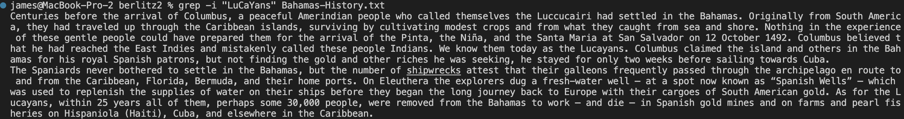
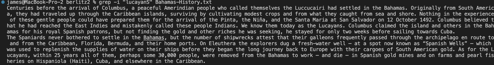
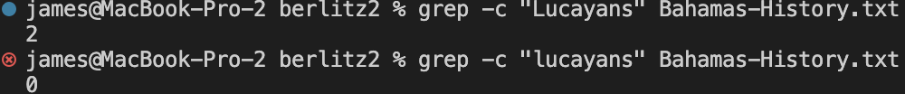
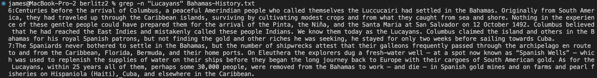
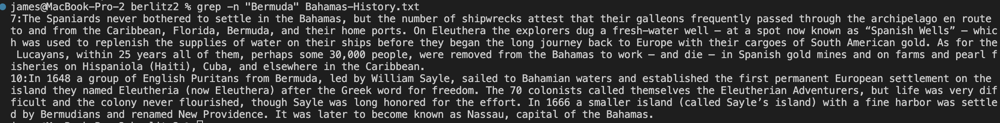
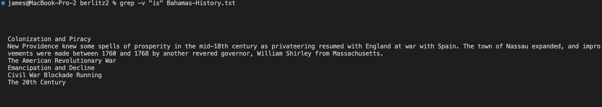
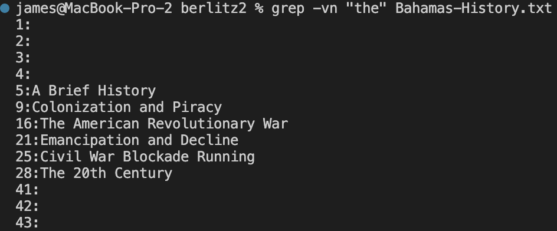
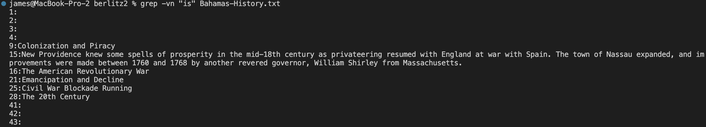

# Lab Report 3
---

# Grep Command and Options
The grep filter is used to search a file for a particular pattern of characters and displays all lines that containes the pattern.   
`grep [options] pattern [files]`
Here are some examples of options that you can use with grep.
```
-c : This prints only a count of the lines that match a pattern
-i : Ignores, case for matching
-n : Display the matched lines and their line numbers.
-v : This prints out all the lines that do not matches the pattern
```

## Examples
Consider the following .txt file as input  
written_2/travel_guides/berlitz2/Bahamas-History.txt
## Case Insensitive Search -i | Source: https://www.geeksforgeeks.org/grep-command-in-unixlinux/
The -i option enables to search for a string case insensitively in the given file. "LuCaYans" and "lucayanS" will result in the same result.  
**Examples**    
   
   
The above commands are looking for a line that contains the same case-insensitive string pattern for "LuCaYans" and "lucayanS" which is all variations of "lucayans" in Bahamas-History.txt. Since 2 lines in Bahamas-History.txt include the string pattern "lucayans" in any form, the command returns 2 lines. This command is useful for searching up all instances of a string pattern without thinking about the uppercase and lowercase of each letter.
  
## Displaying the Number of Matches -c | Source: https://www.geeksforgeeks.org/grep-command-in-unixlinux/
We can find the number of lines that matches the given string/pattern.    
**Examples**    
   

The above command is looking for the number of lines that contains the exact same string pattern for "Lucayans" and "lucayans in Bahamas-History.txt. Since 2 lines include the string pattern "Lucayans", the command returns 2. However, if the string pattern searched is "lucayans" the command will return 0 since the exact string pattern does not exist within the file. This command is useful for searching up the number of instances a (case sensitive) specific string pattern is used within a file.

## Show line number with Output -n | Source: https://www.geeksforgeeks.org/grep-command-in-unixlinux/
To show the line number of file with the line matched.    
**Examples**    
   
  
The above command is looking for lines and number of line within the file that contains the exact same string pattern for "Lucayans" and "Bahamas" in Bahamas-History.txt.
Since lines 6, 7 include the string pattern "Bahamas" and lines 7, 10 include the string pattern "Bermuda", the command returns each line with its line number like above. This command is useful for searching up for where exactly the string pattern is located within a file and the contents of each line that has it.

## Inverting the Pattern Match -v | Source: https://www.geeksforgeeks.org/grep-command-in-unixlinux/
You can display the lines that are not matched with the specified search string pattern using the -v option.  
**Examples**    
   
   

The above command is looking for lines within the file that does **not** contain the exact same string pattern for "the" and "is" in Bahamas-History.txt. Since the above lines do not include the specific string pattern "the" and "is", the command returns all lines without the string including blank lines. This command is useful for looking up lines that does not include a specific string pattern. (By coupling with the option -n mentioned above, it is possible to see which exact lines are returned from -v.)   

   
  
