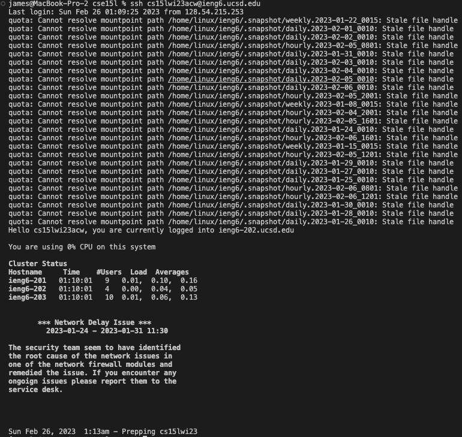

# Lab Report 4
---

## CSE Labs Done Quick  
  
**Required Tasks in Order** 
-Log into ieng6 
-Clone your fork of the repository from your Github account 
-Run the tests, demonstrating that they fail  
-Edit the code file to fix the failing test 
-Run the tests, demonstrating that they now succeed 
-Commit and push the resulting change to your Github account (you can pick any commit message!) 

**Logging into ieng6**  
First, I logged into ieng6 by using `<up> ssh cs15lwi23acw@ieng6.ucsd.edu` in order to bring up the previous command I used like below. 

