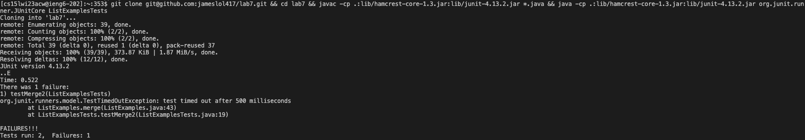
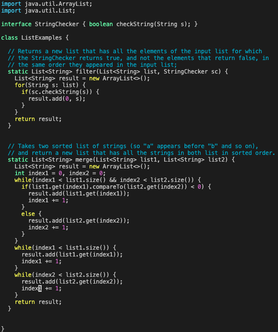
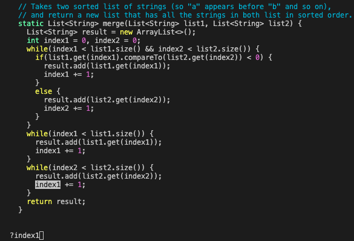
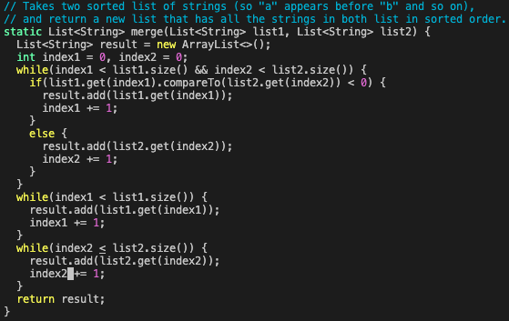
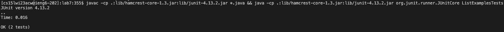
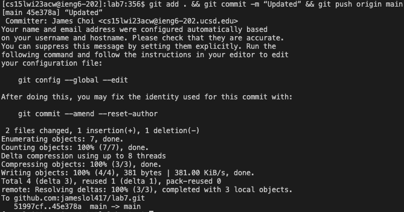

# Lab Report 4
---

## CSE Labs Done Quick  
  
**Required Tasks in Order** 
-Log into ieng6 
-Clone your fork of the repository from your Github account 
-Run the tests, demonstrating that they fail  
-Edit the code file to fix the failing test 
-Run the tests, demonstrating that they now succeed 
-Commit and push the resulting change to your Github account (you can pick any commit message!)   

**Logging into ieng6**  
First, I logged into ieng6 by using `<up> ssh cs15lwi23acw@ieng6.ucsd.edu` in order to bring up the command I used before. 
  
**Cloning my fork from repository & Running the tests** 
`<up><up><up><up><up> git clone git@github.com:jameslol417/lab7.git && cd lab7 && javac -cp .:lib/hamcrest-core-1.3.jar:lib/junit-4.13.2.jar *.java && java -cp .:lib/hamcrest-core-1.3.jar:lib/junit-4.13.2.jar org.junit.runner.JUnitCore ListExamplesTests`  
Then, I first pressed 5 up buttons to access the above command. The above command first clones into my repository for the fork of lab7, switches the directory to lab7, compiles and runs the JUnit tests to show that they fail at once.
 
**Editing and Fixing the code** 
Then, I used `<up><up><up><up><up> ` to bring my `vim ListExamples.java` command and ran it to bring up the VIM editor for ListExamples.java. 
The result of the following command is:  
  
After that, I typed `?index1` to reverse search the wrong part in the code which was *index1* and pressed `<Enter>`.  
  
Typing `cw` I was able to remove *index1* and I typed `index2<esc>` to fix the wrong code and get out of VIM insertion. 

Finally, I typed `:wq` to save and exit out of VIM editor.  
**Running the tests, showing that they work**
Then, I used `<up><up><up><up><up>` to use the command  
`javac -cp .:lib/hamcrest-core-1.3.jar:lib/junit-4.13.2.jar *.java && java -cp .:lib/hamcrest-core-1.3.jar:lib/junit-4.13.2.jar org.junit.runner.JUnitCore ListExamplesTests` 
which compiles and runs the test. The test runs successfully. 
  
**Commiting and Pushing the changes**   
By using `<up><up><up><up><up>` I was able to use `git add . && git commit -m “Updated” && git push origin main` in order to *git add* the changes then *commiting* them with the message "Updated." Finally, I pushed the changes from ieng6 server to my github repository. 
  
