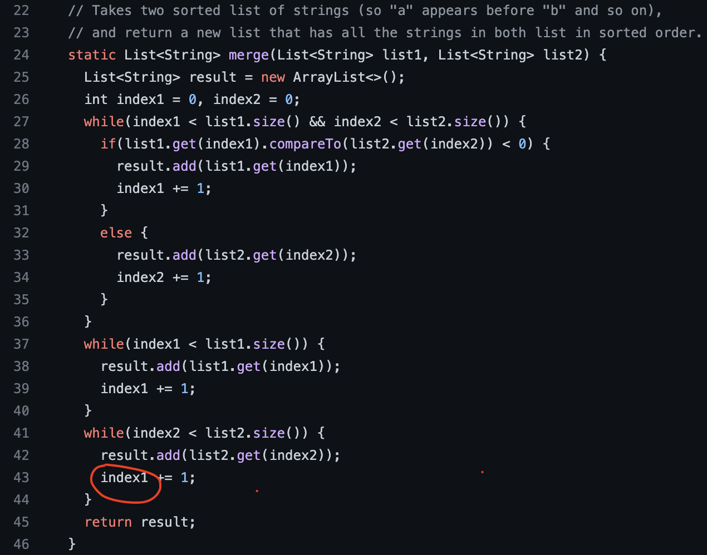
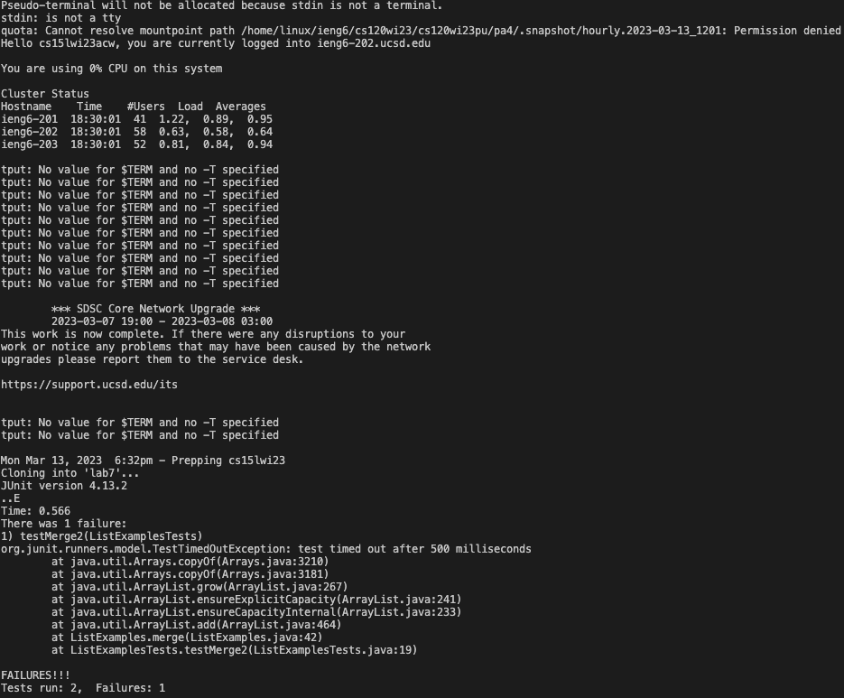
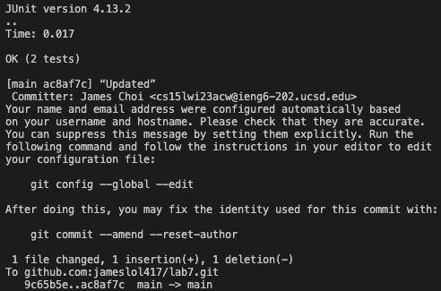
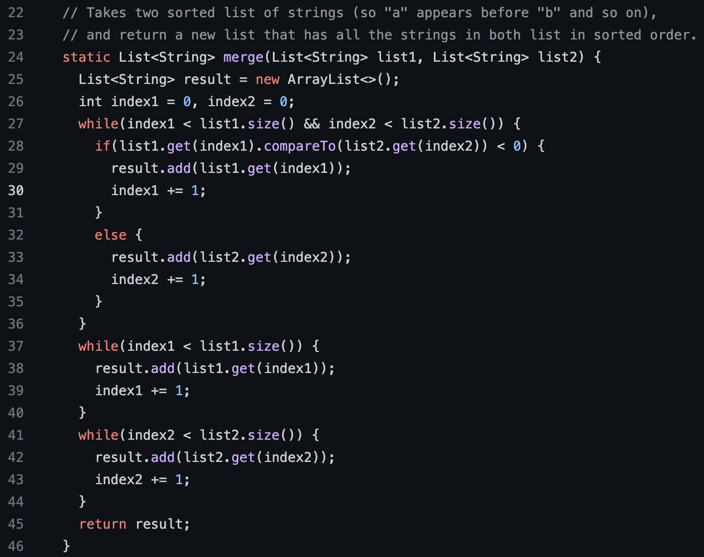

# Lab Report 5
---

## CSE Labs Done Quick (w/ Bash Scripts!)  

Previously, on Lab Report 4, the tasks were   
**Required Tasks in Order**     
-Log into ieng6   
-Clone your fork of the repository from your Github account   
-Run the tests, demonstrating that they fail    
-Edit the code file to fix the failing test   
-Run the tests, demonstrating that they now succeed   
-Commit and push the resulting change to your Github account     

At my last attempt, I failed to overcome the boundaries of man. So this time I plan on using the power of bash scripts to speed up the process.   

## Creating the bash script
First, I created a bash script that will do the tasks in consecutive order.   
By mostly doing the same process as lab report 4, the code looks like the following:      
```
ssh cs15lwi23acw@ieng6.ucsd.edu << EOF
    git clone git@github.com:jameslol417/lab7.git
    cd lab7
    javac -cp .:lib/hamcrest-core-1.3.jar:lib/junit-4.13.2.jar *.java
    java -cp .:lib/hamcrest-core-1.3.jar:lib/junit-4.13.2.jar org.junit.runner.JUnitCore ListExamplesTests
    sed -i '43s/index1/index2/' ListExamples.java
    javac -cp .:lib/hamcrest-core-1.3.jar:lib/junit-4.13.2.jar *.java
    java -cp .:lib/hamcrest-core-1.3.jar:lib/junit-4.13.2.jar org.junit.runner.JUnitCore ListExamplesTests
    git add .
    git commit -m “Updated”
    git push origin main 
EOF
```
At first, the code logs into ieng6 using the ssh command followed by `<< EOF`
which tells the shell that I am going to enter a multiline string until the "tag" `EOF` which is in the last line of the bash script.       
Then I first *git clone* into my lab7 repository that I forked before.      
After changing the directory to lab7 using `cd lab7`, I compile and run the tests to demonstrate that they fail.
In order to edit the code to fix the failing test, previously, I manually did this through vim which slowed down my process by a lot.       
However, by using the *sed* command, which is a powerful stream editor that can perform editing tasks on text files I was able to automate the process.     
`sed -i '43s/index1/index2/' ListExamples.java` has an option `-i` that tells the editor to modify the file in place.       
`'43s/index1/index2/'` is used in the order *line_of_code/old_text/new_text* which means to replace "index1" in line 43 to "index2" as desired.     
Finally, `ListExamples.java` is the file to edit.       
After modifying the buggy code, I compile and run the tests to demonstrate they run properly.
Lastly, I use `git add .`, `git commit -m “Updated”` , `git push origin main` in order to add and commit the changes with the message "Updated" and push to origin.

## Running the code in Action
After writing the script, I ran the code with the following results:    
      
*ListExamples.java before the commit*       
      
*Running the bash script*       

*Successful log in to ieng6, Cloning to respository, Running tests to demonstrate they fail*    

*Modifying the code, Running tests to success, Add&Commit&Pushing the changes*      
      
*ListExamples.java after the commit(index1 has been modified to index2)*    